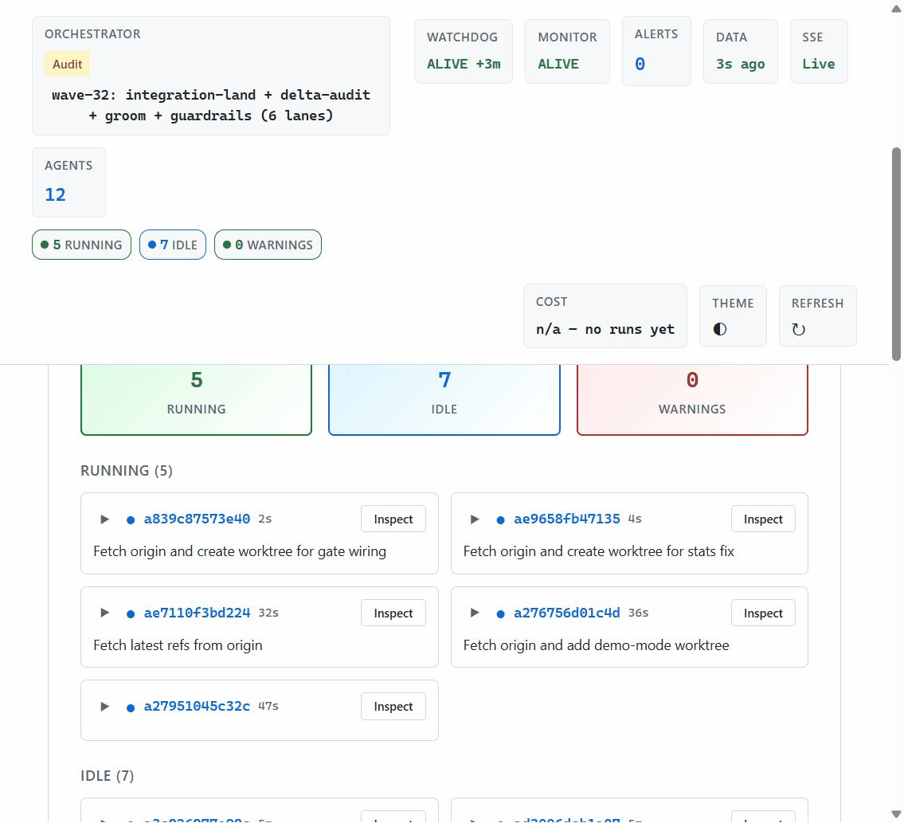
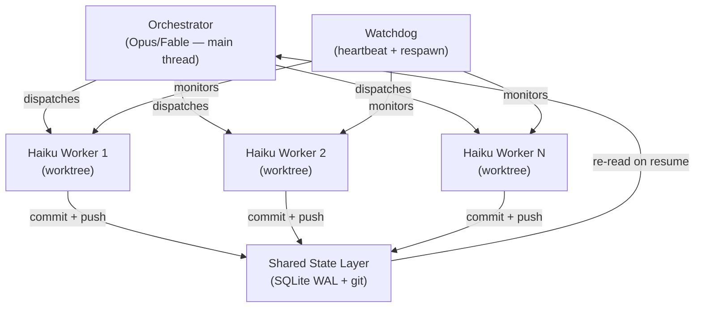

<p align="center">
  
</p>

<p align="center">
  <em>Crash-only multi-agent orchestration — restart IS recovery. Stateless workers, durable filesystem state, no central server to lose.</em>
</p>

<p align="center">
  <a href="https://github.com/matt82198/aesop/actions/workflows/ci.yml"></a>
  <a href="https://www.npmjs.com/package/@matt82198/aesop"></a>
  <a href="https://www.npmjs.com/package/@matt82198/aesop"></a>
  <a href="https://www.npmtrends.com/@matt82198/aesop"></a>
  <a href="LICENSE"></a>
</p>

**Aesop is an autonomous coding-agent harness that built itself** — hundreds of PRs merged across 30+ waves, every number counted from the repo's own git history ([receipts below](#aesop-builds-itself)), every merge gated by guardrails that live in code, not prose. Crash-only by design: restart is the only recovery path.



*The actual dashboard during wave 2 of the 2026-07-30 session: 12 agents, 5 lanes running, live PR board — not a mockup.*

## Why It's Different

Each framework below is good at what it optimizes for. Aesop optimizes for the part they leave to you: **shipping verified merges unattended** — fail-closed gates in code, crash-only state, receipts regenerable from git.

| | Orchestration model | Verification story | State model |
| --- | --- | --- | --- |
| **LangGraph** | Graph workflows you define in code — excellent control flow | You build the checks; no built-in merge gate | Checkpointers (SQLite/Postgres) you configure |
| **AutoGen** | Conversation-driven multi-agent teams | Human-in-the-loop or custom evaluators | Conversation history per run |
| **CrewAI** | Role-based crews with task pipelines — fast to prototype | Optional QA agents you wire in | Task outputs handed between agents |
| **OpenHands** | One autonomous dev agent in a sandbox | Agent self-verifies; you review the PR | Sandboxed workspace per session |
| **Claude Code (plain)** | One interactive session, subagents on demand | You watch and verify by hand | Session context, gone on exit |
| **Aesop** | Parallel Haiku fleets over disjoint file lanes; orchestrator stays on the main thread | Verified-merge discipline: fail-closed secret scan, re-run of the exact CI gate, adversarial review — [gates that have actually fired](#evidence--receipts) | Crash-only: durable files + git + SQLite event log; restart IS recovery |

## What It Does

**Aesop** is an **orchestration harness that runs fleets of LLM coding agents**, verifies their output, and ships merge-ready code to CI. Each agent reads your repository state, fixes a ranked backlog item, runs tests locally, and auto-pushes. If a machine crashes mid-task, the next run re-reads from disk and continues — no external state server, no vector DB, no consensus machinery. The entire system and all decisions live in source-controlled, human-diffable files: git history, STATE.md, BUILDLOG.md, guardrail scripts. Aesop is battle-tested: 191 test suites across 3 harnesses (shell, Node, Python), 13 core domains built in parallel, 5-round audit convergence to zero verified defects, 4x measured cost reduction—all shipped by its own `/buildsystem` loop.

## How It Works

**Agent behavior is source code.** Every orchestration rule lives in durable files (STATE.md, BUILDLOG.md, Python guardrails, git history). When a machine fails, you re-read from disk—no special recovery path. The architecture is: crash-only workers (request-scoped Haiku agents over persistent filesystem state, 1/5 the per-token cost of Opus — see [docs/DISPATCH-MODEL.md](./docs/DISPATCH-MODEL.md)), persistent filesystem brain (git-backed), fail-closed guardrails (pre-push secret-scan, cost ceiling, verification re-runs), and observable heartbeats (to detect and auto-restart stalls).

**Proof:** This repo is built entirely by Aesop. Haiku proved sufficient for seam-level judgment tasks (39/39; pre-declared ceiling rule flags limited discrimination — sufficiency floor, not tier equivalence). Frontier reasoning and long-horizon planning are out of scope. Removing the hierarchical supervisor layer cut dispatch cost ~4× at identical graded quality (A/B; topology cancelled, data kept). The loop study isolates the lever behind that recovery: putting the failing repro test in context lifts one-shot hard-task pass rate +16.7pp on its own; the full seated repair loop reaches 77.2% overall (from a 67.8% checkpoint baseline), with the hard-task gain driven by the repro-test-in-context prompt lever rather than repair iteration.

### Architecture Overview



Three layers: the orchestrator (Opus/Fable) stays on the main thread for prompt-cache efficiency; parallel Haiku workers run in isolated worktrees (1/5 the per-token cost of Opus); durable state lives in SQLite WAL + git-committed files (STATE.md, BUILDLOG.md). On crash, the orchestrator re-reads from disk -- no special recovery path. Full diagram: [docs/ARCHITECTURE.md](./docs/ARCHITECTURE.md).

## Why It Matters

Crash recovery is not a special path; it is how the system *always* starts. This design choice eliminates distributed consensus, external state servers, and recovery machinery. The trade-off: you own the git repo as your state layer, and you provide the human-in-the-loop to set goals and vet outbound gates (publishing, releases, history rewrites). The result: crash-only (request-scoped workers over persistent filesystem state) is simpler, faster to debug, and easier to audit than systems with hidden distributed state.

**Why it's built this way:** [The Aesop Hypothesis](./docs/THE-AESOP-HYPOTHESIS.md) — the design philosophy, the trade-offs, the cancelled architectures with published data.

**New in 0.5.0:** Swap the **worker** and **orchestrator** model (Claude, Codex, or any OpenAI-compatible endpoint) from one `seats` config block without code changes. See [docs/MICROKERNEL.md](./docs/MICROKERNEL.md) for the two-seat architecture and a 60-second quickstart. Single-instance proven; multi-instance coordination is scheduled.

## Feature Demo

**One-turn wave** — Run a complete build cycle (tests, build, docs, review, merge, audit) end-to-end:
```bash
python driver/wave_loop.py --manifest wave.json --one-turn
```
Ranks backlog, dispatches parallel Haiku workers, runs tests, audits the output. Produces a JSON report of all agent runs and their verdicts.

**Multi-model drivers** — Choose your backend (Claude Code, Ollama, OpenRouter) with one config line:
```json
{ "backend": "openai-compatible", "model": "mistral-small", "base_url": "http://localhost:1234/v1" }
```
Verification tiers auto-adapt to backend capability—weaker models get stronger safety checking without code changes.

**Wave templates** — Bootstrap a new fleet with a preset architecture:
```bash
python tools/wave_templates.py saas --project-name my-api --base-dir /workspace
```
Generates a manifest for typical 3-tier (API, frontend, ops) or data pipelines.

**Live dashboard** — Real-time view of fleet health, security alerts, work-item kanban, cost analytics:
```bash
npx @matt82198/aesop dash
```
Opens http://localhost:8770. Four views: Overview (agents, events), Work (kanban), Activity (reasoning tail), Cost (spend/tokens).

**Health score** — Readiness assessment: env, git, Python, Node, ports, config, hooks:
```bash
python tools/health_score.py
```
Outputs a scorecard of system readiness; --json for parsing.

**Self-monitoring daemon** — Runs every 150s: backs up work, scans secrets, detects drift:
```bash
npx @matt82198/aesop watch
```
Pre-push hook blocks leaks. Heartbeat signals liveness; monitor auto-detects stalls and restarts the fleet.

**Hardened gate stack** — Fail-closed secret-scan, adversarial review (default-on):
```bash
python tools/secret_scan.py --staged   # Blocks push if leak detected
```
Exits with failure on file-read errors (not silently passing). CI validates every merge.

**Parallel test battery** — Run all four test harnesses concurrently with isolated logs and enforced timeouts (`tools/test_battery.py` — ~5.4 min vs ~10 serial).

**Windows CI green** — Full parity support on Windows-latest GitHub Actions: promoted to a required check after 6 consecutive green main runs.

<!-- STATS:START -->

## Aesop builds itself

Aesop is built entirely by its own `/buildsystem` wave cycle—running parallel Haiku fleets across ranked backlog items, verifying merges, auditing orchestration health. These stats are the receipts: all numbers computed LIVE from git, verified by anyone who clones.

| Metric | Value |
| --- | --- |
| Merged PRs | 538 <!-- metrics-verified: self_stats.py (git log) --> |
| Total Commits | 1487 <!-- metrics-verified: self_stats.py (git log) --> |
| Project Age | 18 days <!-- metrics-verified: self_stats.py (git log) --> |
| Insertions + Deletions | 298,279 <!-- metrics-verified: self_stats.py (git log) --> |
| Files Tracked | 955 <!-- metrics-verified: self_stats.py (git log) --> |
| Authors | 1 human + 5 Claude model tiers <!-- metrics-verified: self_stats.py (git log) --> |

<!-- STATS:END -->


**Project Timeline:** Aesop is 18 days old, built by 1 human + the fleet. Every number above is regenerable from git history by anyone who clones the repo (`bash scripts/verify-stats.sh --check`); no hidden telemetry.

## Quick Try (2 min, no API keys)

No API keys, no Python, no configuration. Just Node.js >= 18 and git.

```bash
# 1. Clone the repo
git clone https://github.com/matt82198/aesop.git
cd aesop

# 2. Install dependencies
npm install

# 3. See the CLI and all available commands
npx . --help

# 4. Run the preflight readiness check (pure Node.js, no keys needed)
npx . doctor

# 5. Launch the web dashboard (requires Python 3 — optional)
npx . dash
# Opens http://localhost:8770 — four views: Overview, Work, Activity, Cost
```

That is enough to explore the CLI, read the docs, run the test suite (`npm test`), and see the dashboard UI. No API keys are touched.

## Full Setup (orchestration with LLM agents)

To run the actual multi-agent orchestration loop you need:

- **Claude Code CLI** (or another supported backend) with a valid API key
- **Python 3.10+** for guardrails, secret scanning, and the dashboard backend
- **Bash 4+** (or Git Bash on Windows) for daemon scripts

```bash
npx @matt82198/aesop my-fleet --name "api" --repos "/path/to/repo"
```
Copy `skills/` into `~/.claude/skills` to enable the `/power` and `/buildsystem` commands.

See [docs/INSTALL.md](./docs/INSTALL.md) for the complete setup guide (config, daemons, first wave).
See [docs/DEMO.md](./docs/DEMO.md) for a walkthrough of one full wave cycle.

*Wave: one complete build cycle (intake → dispatch → verify → ship) run by the orchestration engine.*


## Why Haiku-First Works

The benchmark proves sufficiency for seam-level engineering tasks: across 39 judgment tasks (code review, severity calibration, root-cause analysis, refactor equivalence, security spots), Haiku scored **39/39** vs Opus **38/39** at 1/5 the per-token cost of Opus (1/3 of Sonnet — list pricing; cost model in [docs/DISPATCH-MODEL.md](./docs/DISPATCH-MODEL.md)). **Measured on seam-level engineering tasks (code review, severity calibration, local orchestration) — not frontier reasoning or long-horizon planning.** See [`bench/results/2026-07-17-judgment-v3-haiku-sonnet-opus.md`](./bench/results/2026-07-17-judgment-v3-haiku-sonnet-opus.md). The pre-declared ceiling rule (when ≥2 tiers score ≥92%, the instrument failed to discriminate) trips on this result — both Haiku and Sonnet achieved 39/39, meaning the benchmark maps a *sufficiency floor*, not tier equivalence. Full analysis: [`bench/results/2026-07-26-judgment-v3-ceiling-addendum.md`](./bench/results/2026-07-26-judgment-v3-ceiling-addendum.md) and [`bench/METHODOLOGY.md`](./bench/METHODOLOGY.md).

## Cost Transparency

Token ledger integration is pending (`token_ledger_available: false` in stats.json). What is available:

- **Relative cost:** Hierarchical dispatch (Sonnet supervisors + Haiku workers) measured at **4.3x weighted cost** vs flat Haiku-only dispatch at identical quality. Full A/B dataset with methodology: [docs/ab-cost-dataset.md](./docs/ab-cost-dataset.md).
- **Per-wave estimate:** ~$0.01-0.02 USD per wave in agent token spend (Haiku-only subagents, per [DISPATCH-MODEL.md](./docs/DISPATCH-MODEL.md)). 31 waves x $0.02 upper bound = ~$0.62 in fleet tokens (excludes orchestrator main-thread tokens, tracked separately).
- **CI economics:** Wave 1 measured 8.9 CI runs per merged PR (41.9% waste from strict-mode treadmill); structural fixes targeting ~3 runs/PR steady-state. Full breakdown: [docs/RECEIPTS.md](./docs/RECEIPTS.md).

Dollar-precise per-wave token ledger and cost-per-LOC metrics are on the roadmap. The numbers above are the honest current state.

## Known Limitations

- **Benchmark is curated, not sampled:** The 39-task judgment set trips the pre-declared ceiling rule; it measures a sufficiency floor (Haiku is good enough for this domain), not equivalence or tier ranking. See [`bench/METHODOLOGY.md`](./bench/METHODOLOGY.md) for boundary conditions.
- **MCP server is read-only by design:** The state-store projections are accurate only as of the last successful run state. Real-time multi-agent coordination is not yet implemented.
- **Seam-level only:** This repo's agents operate within the seam (local orchestration, code review, severity assessment, test bifurcation). Frontier reasoning tasks (architecture redesign, novel algorithms) are out of scope and will underperform.

## Operational Receipts

For transparency on production incidents, latency profiles, and handoff fidelity:

- **[docs/INCIDENTS.md](./docs/INCIDENTS.md)** — Classified incident log (crashes, stalls, false-greens, refusals)
- **[docs/LATENCY.md](./docs/LATENCY.md)** — Wave cycle turnaround, agent wall-clock profiling, repair-loop latency data
- **[docs/HANDOFF-CERTIFICATE.md](./docs/HANDOFF-CERTIFICATE.md)** — Durable state transfer fidelity and recovery proof
- **[docs/CROSSOS-DRIFT.md](./docs/CROSSOS-DRIFT.md)** — Windows/Linux parity testing and reconciliation

## Evidence & Receipts

All evidence is committed to the repo and can be regenerated or verified by cloning.

**Gates That Fired:**  
The guardrails below are not theoretical. Real activations: the pre-push secret scan has blocked pushes—including a benchmark-vocabulary false-positive where the gate was kept strict and the content reworded; an agent's `--no-verify` bypass attempt was caught and the flag banned from every dispatch template; the watchdog has detected and auto-restarted stalled agents; and self-reported "green" results have been repeatedly refuted by re-running the exact CI gate—in one audited overnight session, nine such claims failed the re-run (BUILDLOG record). An early `--admin` merge of hallucinated docs led to those flags being forbidden in every orchestrated prompt.

- **Metrics gate:** [`bash scripts/verify-stats.sh --check`](./scripts/verify-stats.sh) — verifies stats.json matches git; README refreshed on every commit.
- **Test suite count:** [`python tools/verify_test_suite_count.py --check`](./tools/verify_test_suite_count.py) — confirms test count hasn't drifted.
- **Benchmark pre-registration:** [`bench/SEAM-STUDY-PREREG.md`](./bench/SEAM-STUDY-PREREG.md) — pre-declared design, success criteria, ceiling rule.
- **Equivalence margin amendments:** [`bench/METHODOLOGY.md`](./bench/METHODOLOGY.md) — pre-reg record and all amendments after each run.
- **Dated results:** [`bench/results/`](./bench/results/) — all judgment and frontier runs with timestamps.
  - **Loop study (2026-07-28):** [`bench/results/seam-loop-study-2026-07-28.md`](./bench/results/seam-loop-study-2026-07-28.md) — checkpoint recovery + repair loop data: 122/180 (checkpoint) → 139/180 (loop), +20pp on hard tasks — the study isolates the repro-test-in-context prompt lever (+16.7pp one-shot on hard tasks) as the main driver.
- **Kill switch & ceilings:** [`tools/halt.py`](./tools/halt.py), [`tools/cost_ceiling.py`](./tools/cost_ceiling.py) — enforced at dispatch time.
- **Secret gate:** [`tools/secret_scan.py`](./tools/secret_scan.py) — pre-push enforcement; non-zero exit on leak.
- **Green-never-ran detection:** [`tools/ci_workflow_lint.py`](./tools/ci_workflow_lint.py) — ensures every CI suite actually runs before merge.

## Learn More

- **[AesopServer](https://github.com/matt82198/AesopServer)** — Also ported to a JVM/Spring Boot read-only observer (separate repo).
- **[docs/INSTALL.md](./docs/INSTALL.md)** — Setup and first wave  
- **[docs/MICROKERNEL.md](./docs/MICROKERNEL.md)** — The two swappable seats (worker + orchestrator), the invariant Report/state boundary, and a 60-second quickstart for swapping either seat's model  
- **[docs/PORTING.md](./docs/PORTING.md)** — Adopter's guide: port Aesop to your repo (prerequisites, scaffold, 10 failure modes)  
- **[docs/HOW-THE-LOOP-WORKS.md](./docs/HOW-THE-LOOP-WORKS.md)** — Concrete walkthrough of a wave cycle  
- **[docs/DISPATCH-MODEL.md](./docs/DISPATCH-MODEL.md)** — Cost analysis and scaling  
- **[docs/CARDINAL-RULES.md](./docs/CARDINAL-RULES.md)** — 10 foundational principles  
- **[docs/autonomous-swe.md](./docs/autonomous-swe.md)** — What "autonomous" means (and doesn't), evidence for all claims, honest limits  
- **[RELEASE-NOTES.md](./RELEASE-NOTES.md)** — Version 0.5.0: relicensed to MIT, hardened machinery, observability improvements, dashboard MVP, and incident logging

## Contributing

Aesop is **open source** under the MIT License. Patches and contributions are welcome via pull request.

- **Issues and bug reports** — tell us what's broken or confusing.
- **Discussion and ideas** — feature requests, design critiques, use-case questions.
- **Code contributions** — fork, commit, and open a PR; we'll review and merge.

The repo develops itself via its own `/buildsystem` loop; see [CONTRIBUTING.md](./CONTRIBUTING.md) for details.

## License

**Open source** under the [MIT License](./LICENSE). This project started as a personal research project and grew into a real system; it has been relicensed to MIT on 2026-07-29 to open the technology fully.

Copyright 2026 Matt Culliton.

## References

- [Anthropic Claude API docs](https://docs.anthropic.com)
- [Claude Code CLI](https://github.com/anthropics/claude-code)
- [Git docs](https://git-scm.com/doc)

---

**Aesop**: Autonomous developer for any repository, built by Aesop itself. May your orchestrator be wise and your subagents swift.
